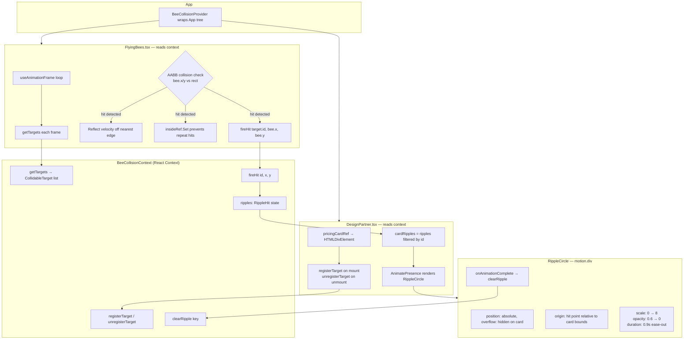
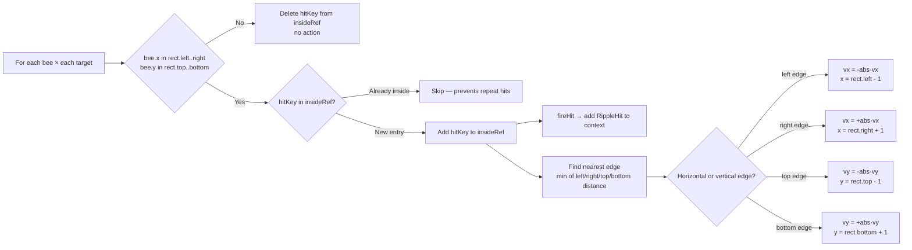
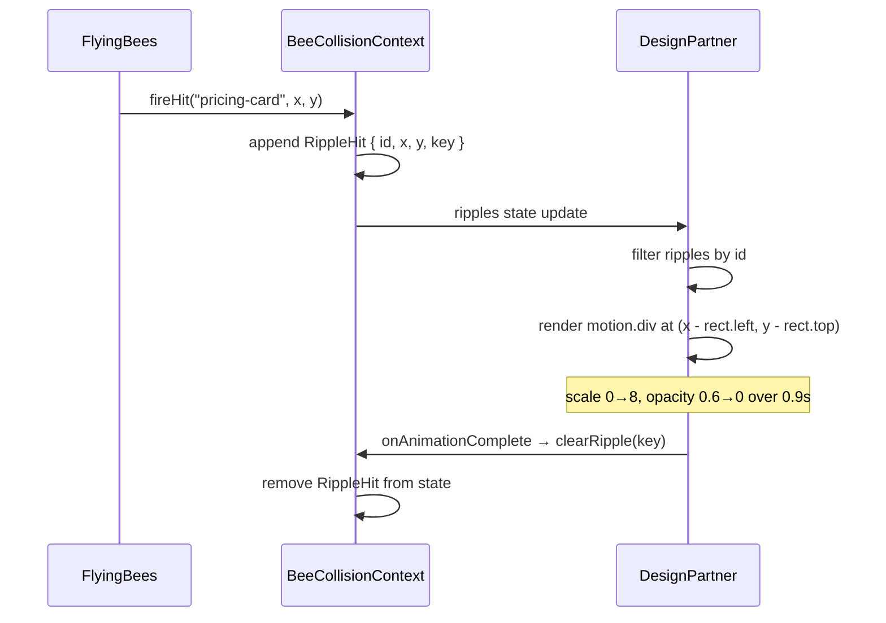

# Bee–Card Collision Animation

Bees physically bounce off the "Exclusive Partner Pricing" card and trigger a gold ripple wave at the point of impact.

---

## Architecture

---

## Collision Detection (per frame)

---

## Ripple Lifecycle

---

## Key Files

| File | Role |
|---|---|
| `src/context/BeeCollisionContext.tsx` | Shared state: target registry + ripple hits |
| `src/components/FlyingBees.tsx` | Reads targets, runs AABB collision, fires hits |
| `src/components/DesignPartner.tsx` | Registers card ref, renders ripple overlays |
| `src/App.tsx` | Mounts `BeeCollisionProvider` at tree root |
