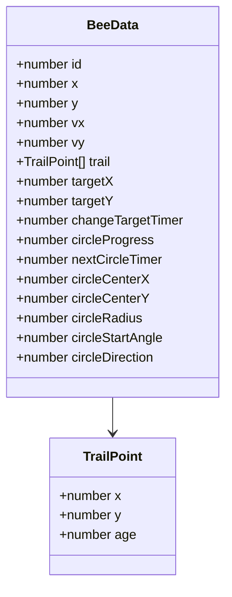
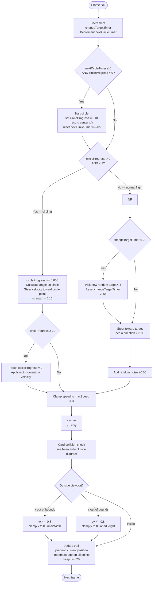
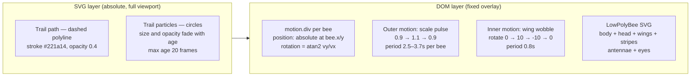
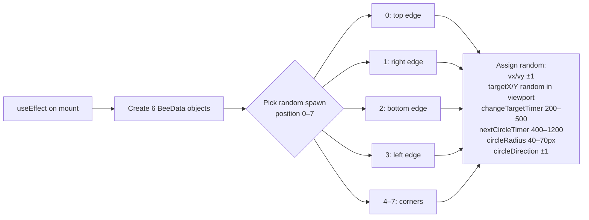

# FlyingBees Animation

Six bees fly autonomously around the viewport. Each bee steers toward random targets, occasionally breaks into circular loops, leaves a fading dot trail, and bounces off screen edges.

---

## Bee State Shape

---

## Per-Frame Animation Loop (useAnimationFrame)

---

## Visual Rendering

---

## Initialization

---

## Key File

| File | Role |
|---|---|
| `src/components/FlyingBees.tsx` | All bee state, animation loop, and rendering |
