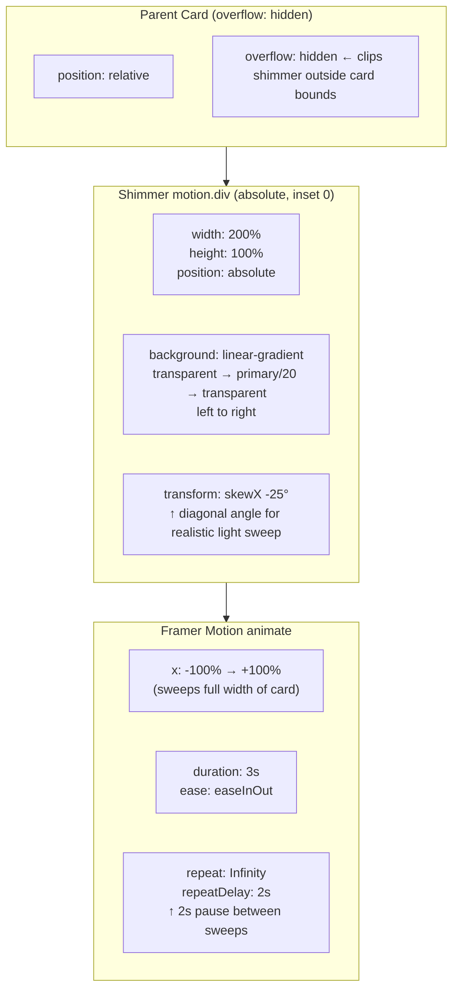
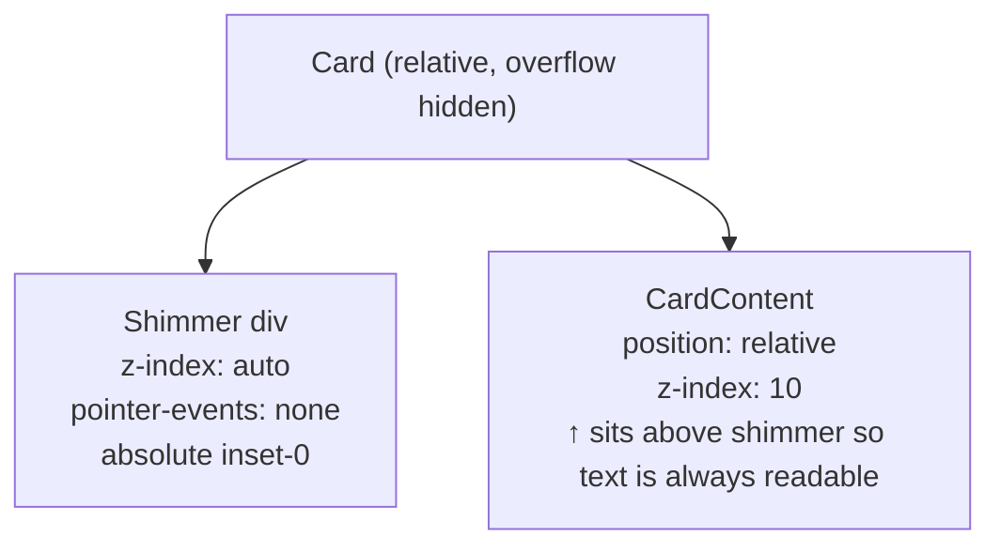
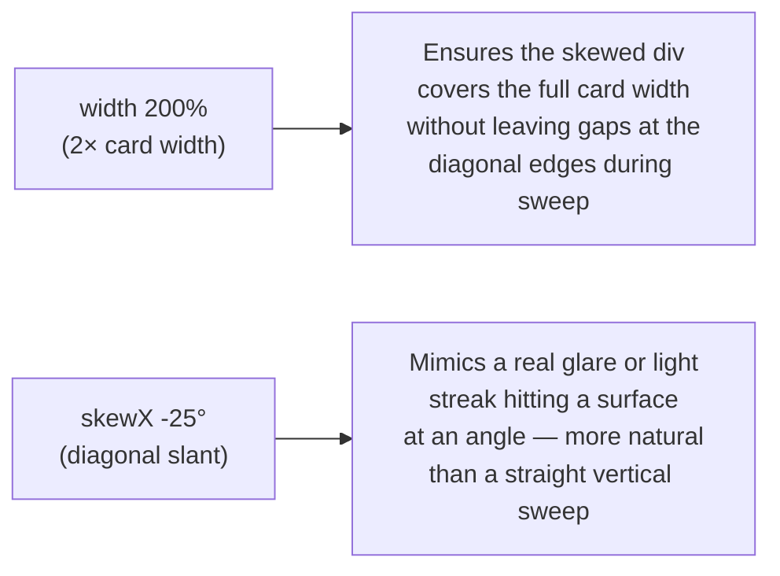

# Shimmer Animation

A diagonal light sweep passes across a card at regular intervals, giving the impression of a reflective surface catching light. Used on the **Competitive Play** card and the **Built for Studios** card in AI Commitments.

---

## Visual Concept

```
Card (overflow: hidden)
┌──────────────────────────────────────┐
│                                      │
│  ░░░░░░░░░░░░░░░░░░░░░░░░░░░░░░░░░░  │
│  ░░░░░░░░░░░░░░░░░░░░░░░░░░░░░░░░░░  │
│  ░░░░░░░░░░░░░░░░░░░░░░░░░░░░░░░░░░  │
└──────────────────────────────────────┘
         ↑
  Shimmer div (200% wide, skewed -25°)
  sweeps from x=-100% to x=+100%
  gradient: transparent → primary/20 → transparent
```

---

## Animation Properties



---

## Timeline

```mermaid
gantt
    title Shimmer cycle (one full repeat)
    dateFormat  s
    axisFormat  %Ss

    section Sweep
    Shimmer travels x -100% to +100%  :active, sweep, 0, 3s

    section Pause
    repeatDelay — shimmer offscreen    :pause, 3, 5s
```



---

## Layering



---

## Why `width: 200%` and `skewX(-25°)`



---

## Key Files

| File | Component | Card |
|---|---|---|
| `src/components/CompetitivePlay.tsx` | `CompetitivePlay` | Competitive Play card |
| `src/components/AICommitments.tsx` | `AICommitments` | Built for Studios card |
