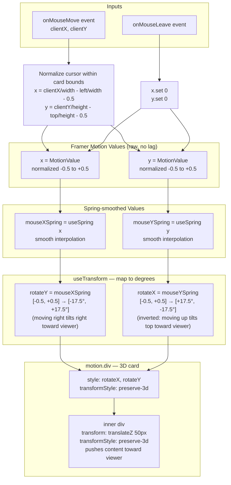
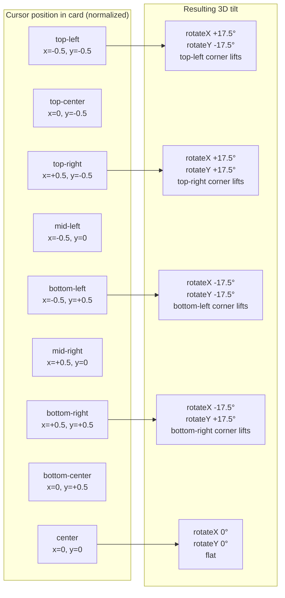
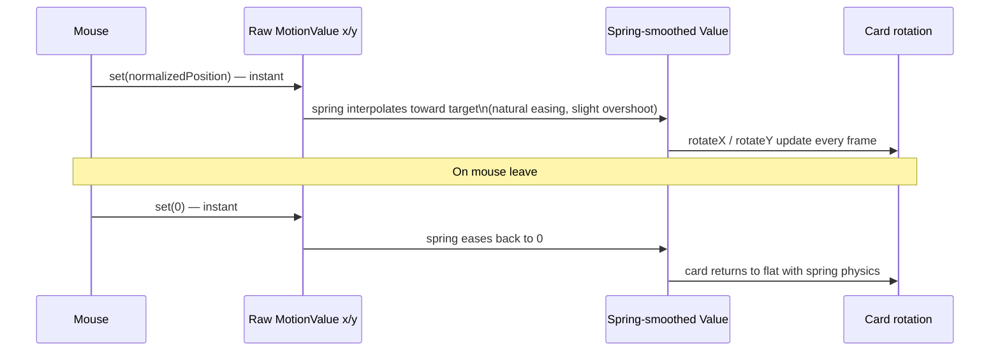
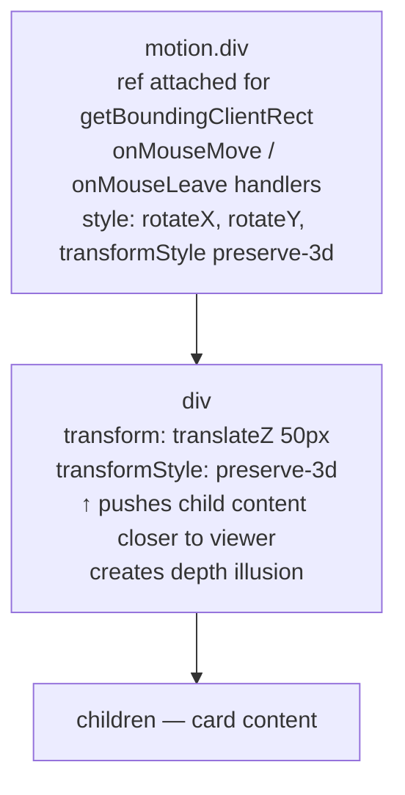

# TiltCard Mouse Hover Animation

Cards tilt in 3D perspective tracking the mouse position. When the cursor leaves, the card springs back to flat. Used on tier cards in `DesignPartner` and the two feature cards in `OriginalsForge`.

---

## Data Flow

---

## Coordinate Mapping

---

## Spring Behavior

---

## DOM Structure

---

## Key Files

| File | Usage |
|---|---|
| `src/components/DesignPartner.tsx` | `TiltCard` wraps each of the 3 tier cards |
| `src/components/OriginalsForge.tsx` | `TiltCard` wraps Arkhives Originals and Forge Platform cards |
